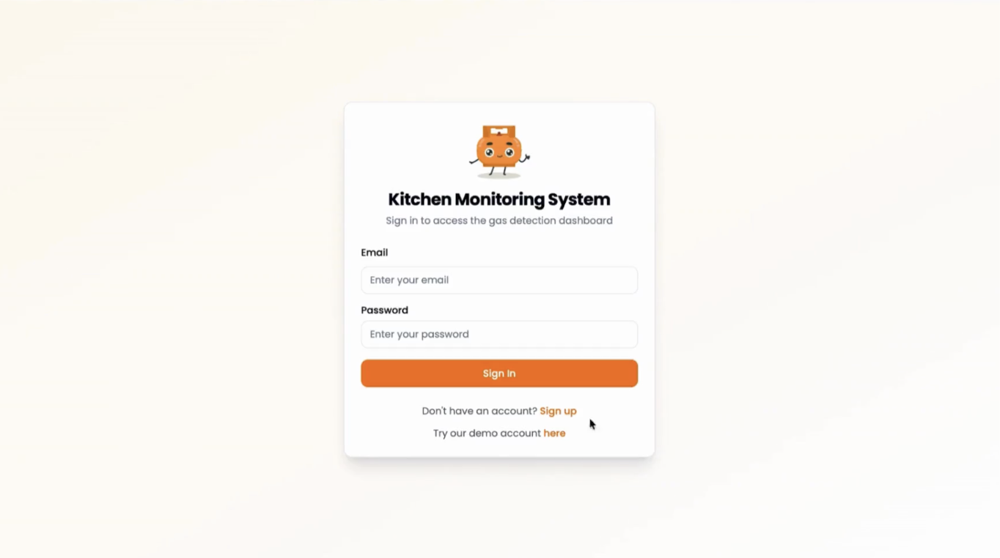
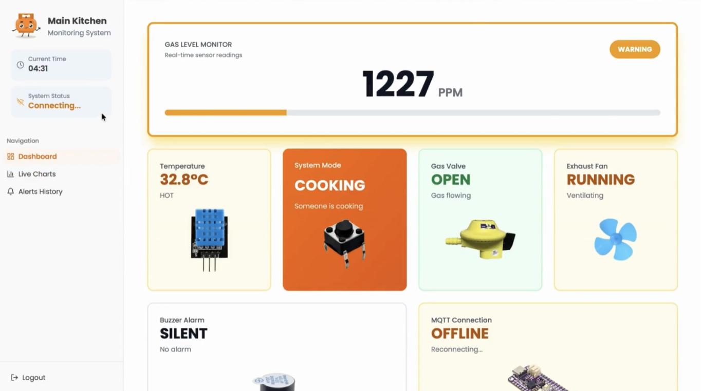
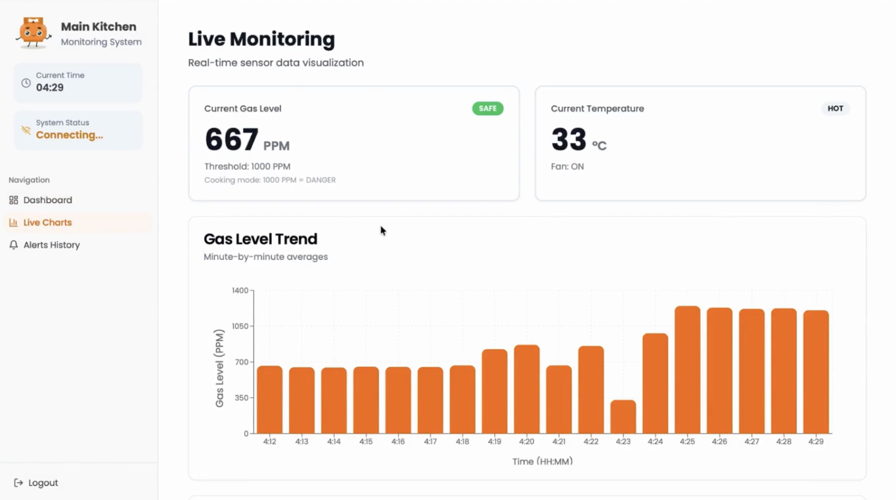
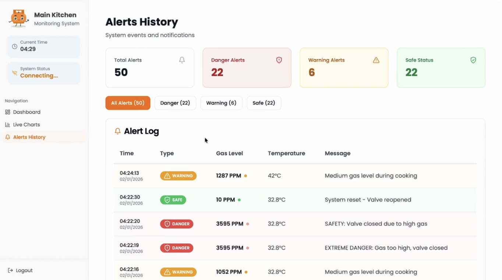

# Gas Leak Detection System

IoT-based smart kitchen gas leak detection system designed to enhance safety, contributing to **UN Sustainable Development Goal (SDG) 11: Sustainable Cities and Communities**.

- Real-time gas leak detection and monitoring
- Automatic safety response (valve shutoff, ventilation, buzzer alert)
- Emergency SMS and phone call alerts
- Cloud-based data storage
- Web dashboard for remote monitoring

[Watch the project demo on YouTube](https://youtu.be/xl6Ct4lqlu4)

<table>
  <tr>
    <td></td>
    <td></td>
  </tr>
  <tr>
    <td></td>
    <td></td>
  </tr>
</table>
